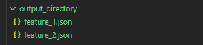
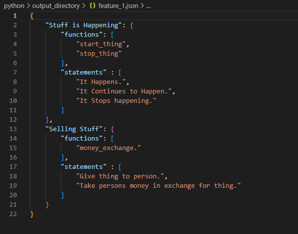
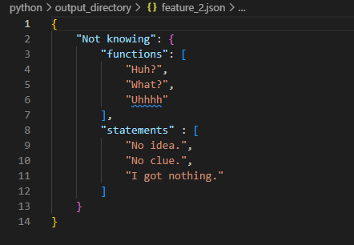

# AaC Gen-Dictionary

The `gen-dictionary-file` command of the AaC Gen-Gherkin plugin generates dictionary step files based on provided dictionary step models.

## gen-dictionary-file Command

```bash
aac gen-dictionary-file architecture-file.aac output/directory
```

### Arguments

#### Architecture File
The AaC file containing the `dictionary_step` definition/s.

#### Output Directory
The directory in which the gherkin feature files will be generated.

## Dictionary Step Definition
The `gen-dictionary-file` command will generate dictionary step files based on the `dictionary_step` definition, which will appear as follows:

```{eval-rst}
.. literalinclude:: ../../../python/tests/dictionary/dictionary_step.aac
    :language: yaml
    :lines: 1-10
    :emphasize-lines: 1
```

The fields present in a `dictionary_step` definition are:

`name`: The given name for the `dictionary_step`

`feature_name`: The name of the feature this step is supporting.

`statements`: A list of dictionary statements.

`functions`: A list of functions used to support the statements provided.

## Command Usage Examples
`dictionary_step.aac` is a file that contains a series of `dictionary_step` definitions.

Running the following command will generate a `dictionary_step` JSON file from the given definitions.

```bash
aac gen-dictionary-file tests/dictionary/dictionary_step.aac ./output_directory
```

It will also return the following output to the command line:

```bash
All AaC constraint checks were successful.
Successfully generated dictionary file(s) to directory: ./output
```
If the architecture file provided to the command is not a dictionary step it will return the following failure message to the command line:

```bash
No step definitions to generate a dictionary steps file.
```

After running the above command, the following two dictionary step files will be generated in `./output_directory`.  The steps are organized based on which feature they support:



The contents of these generated files are bellow:

`feature_1.json`:


`feature_2.json`:

