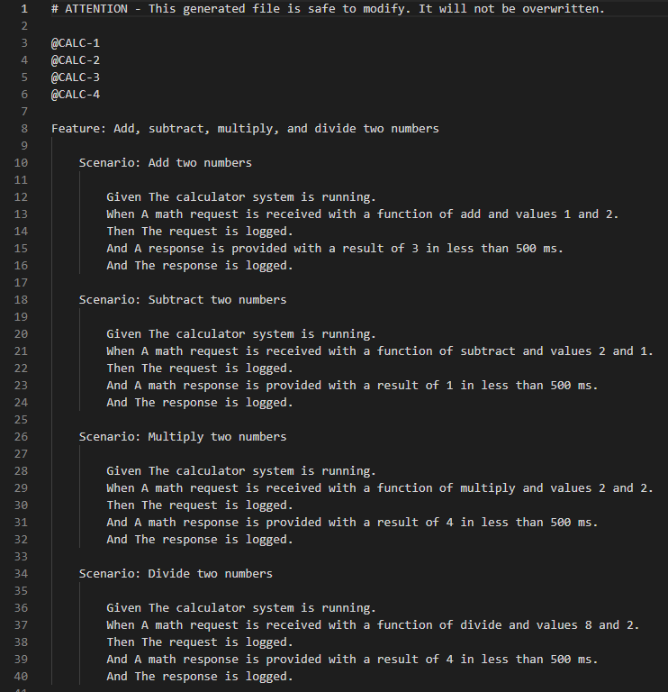
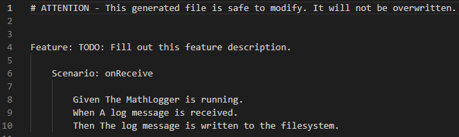

# AaC Gen-Gherkin

The AaC Gen-Gherkin plugin generates gherkin feature files based on provided AaC models.

## gen-gherkin-behaviors Command

```bash
aac gen-gherkin-behaviors architecture-file.aac output/directory
```

### Arguments

#### Architecture File
The AaC file containing the `model` definition/s.

#### Output Directory
The directory in which the gherkin feature files will be generated.

## Definition Type References
The `gen-gherkin` plugin will generate feature files based on the `behavior` field of `model` definitions.
`behavior` definitions also have a field named `acceptance`.  The  `acceptance` field is where the feature files scenario steps will come from.

### Gherkin Syntax
When output to a feature file, a `model`s `behavior` becomes a `feature`, and its `acceptance` becomes a `scenario`.

Each `scenario` has a number of steps:

`given`: An optional step, but is usually recommended to include.  The `given` step describes the models initial state.

`when`: This step describes what kicks off the action the `model` will perform, be it called through a command line or triggered some other way.

`then`: This step describes what happens after the `model` performs its action.  Typically it will include whatever output is created by the `model`'s action.

### Example Model Definition

```{eval-rst}
.. literalinclude:: ../../../python/tests/calc/model/calculator.yaml
    :language: yaml
    :lines: 68-81
    :emphasize-lines: 3, 5, 7, 9, 11
```

Along with the `scenario` steps, `features` and `scenario`s can also have requirements, signified by the `requirement ID` before the `feature` or `scenario`, such as the following feature file, which contains several highlighted examples:


## Plugin Usage Example
The calculator model system contains three model definitions: `calculator`, `mathlogger`, and `mathmessagehandler`.
`mathlogger` and `mathmessagehandler` each contain one behavior definition, while calculator contains two.
The `example_behavior` behavior in the calculator model exists only to demonstrate the gen-gherkin plugins ability to generate multiple feature files per model.

Running the following command will generate a gherkin feature file for each behavior definition in the system.

```bash
$ aac gen-gherkin-behaviors ./tests/calc/model/calculator.yaml ./output_directory
```
It will also return the following output to the command line:

```bash
All AaC constraint checks were successful.
Successfully generated feature file(s) to directory: ./output_directory
```
If the architecture file provided to the command is not a model, or does not contain a behavior field, it will return the following failure message to the command line:

```bash
No applicable behavior to generate a feature file
```

After running the above command, the following four feature files will be generated in `./output_directory`.  The names of the feature files are concatenations of the model name (`calculator`) and the behavior name (`example_behavior`):


The contents of these generated files are bellow:

`calculator_example_behavior_feature_file.feature`:


`calculator_perform_simple_math_function_feature_file.feature`


`mathlogger_api_feature_file`


`mathmessagehandler_api_feature_file.feature`

